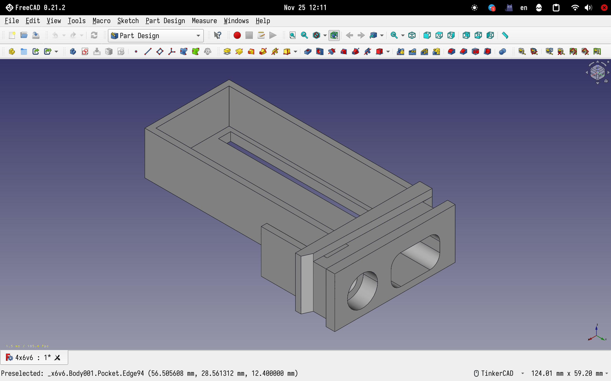
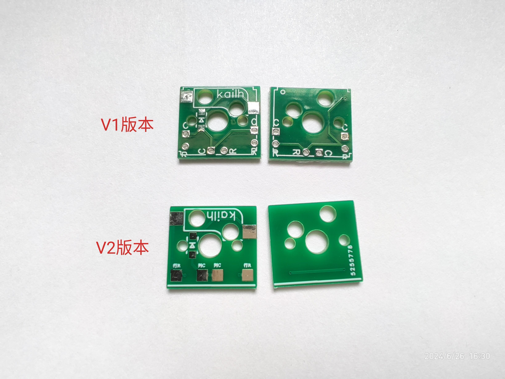
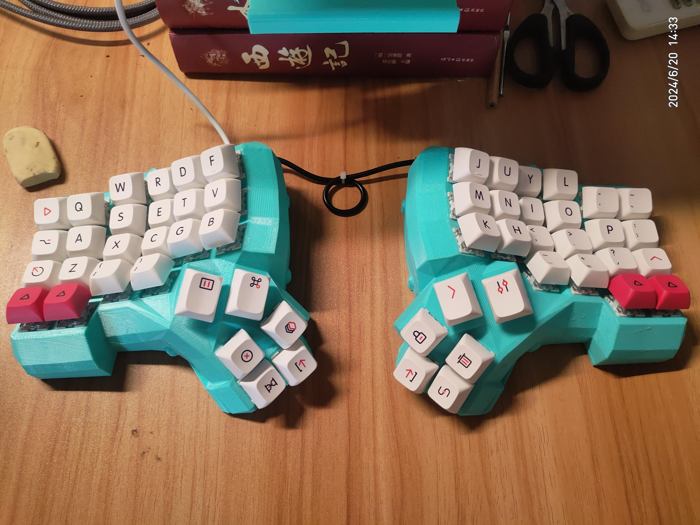

## Note：I am not good at english, so writted in chinese
## 注：本项目外壳接口宽度拓宽，与原支架不适配
## 注：淘宝店铺：无名科技Nologo，有[RP2040_pico_Mini](https://item.taobao.com/item.htm?id=722773242430&mi_id=00008lKuXbaODpZzl6PxsZe3zdLWyitDJLfwKlEchEGv1RM&spm=a21xtw.29978518.0.0&xxc=shop)的开发板，板子宽度和ProMicro一致，无需修改外壳接口宽度,完美替换32U4。但本项目的支架适配更广，可使用常见的STM32F103、RP2040的开发板

